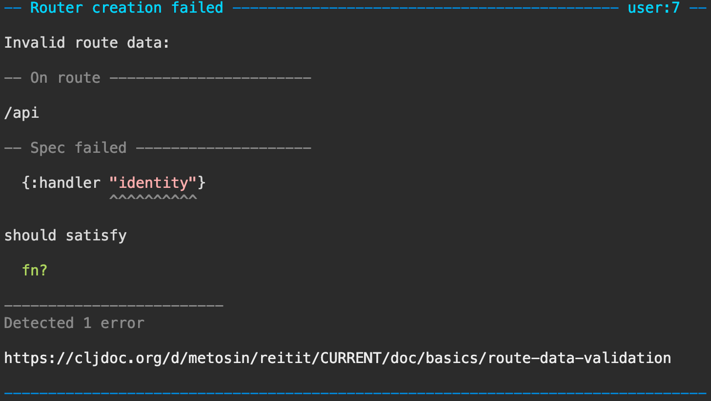
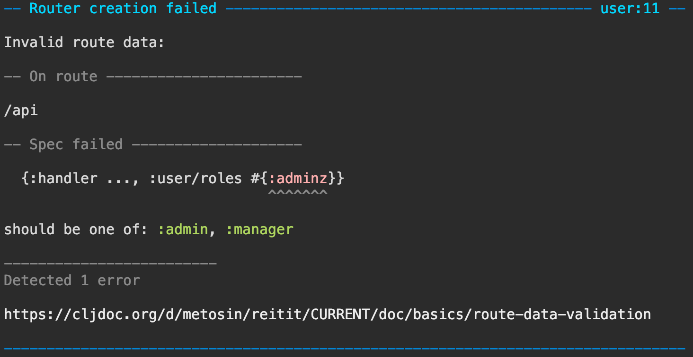
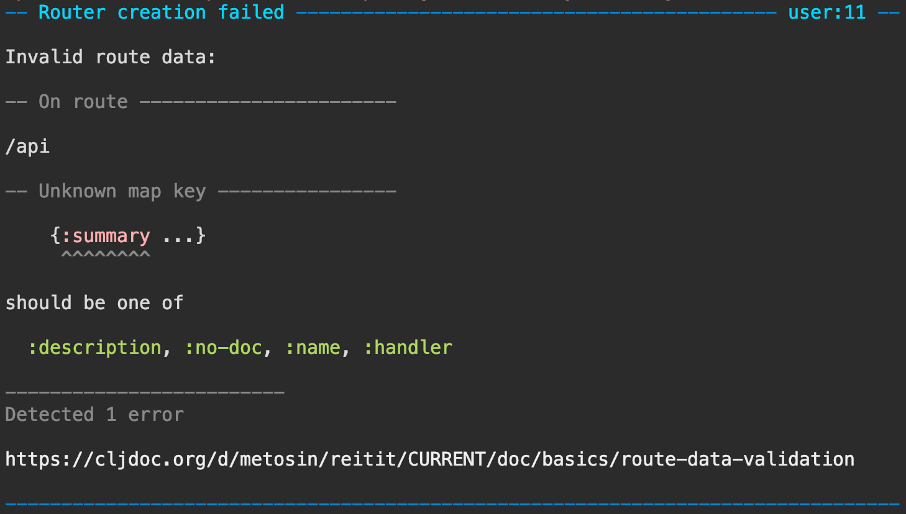
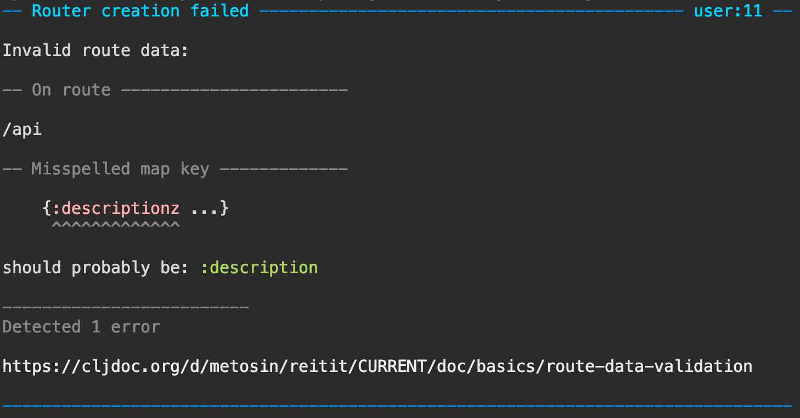

# Route Data Validation

Route data can be anything, so it's easy to go wrong. Accidentally adding a `:role` key instead of `:roles` might hinder the whole routing app without any authorization in place.

To fail fast, we could use the custom `:coerce` and `:compile` hooks to apply data validation and throw exceptions on first sighted problem.

But there is a better way. Router has a `:validation` hook to validate the whole route tree after it's successfuly compiled. It expects a 2-arity function `routes opts => ()` that can side-effect in case of validation errors.

## clojure.spec

Namespace `reitit.spec` contains specs for main parts of `reitit.core` and a helper function `validate` that runs spec validation for all route data and throws an exception if any errors are found.

A Router with invalid route data:

```clj
(require '[reitit.core :as r])

(r/router
  ["/api" {:handler "identity"}])
; #object[reitit.core$...]
```

Failing fast with `clojure.spec` validation turned on:

```clj
(require '[reitit.spec :as rs])

(r/router
  ["/api" {:handler "identity"}]
  {:validate rs/validate})
; CompilerException clojure.lang.ExceptionInfo: Invalid route data:
;
; -- On route -----------------------
;
; "/api"
;
; In: [:handler] val: "identity" fails spec: :reitit.spec/handler at: [:handler] predicate: fn?
;
; {:problems (#reitit.spec.Problem{:path "/api", :scope nil, :data {:handler "identity"}, :spec :reitit.spec/default-data, :problems #:clojure.spec.alpha{:problems ({:path [:handler], :pred clojure.core/fn?, :val "identity", :via [:reitit.spec/default-data :reitit.spec/handler], :in [:handler]}), :spec :reitit.spec/default-data, :value {:handler "identity"}}})}, compiling: ...

```

### Pretty errors

Turning on [Pretty Errors](error_messages.md#pretty-errors) will give much nicer error messages:

```clj
(require '[reitit.dev.pretty :as pretty])

(r/router
  ["/api" {:handler "identity"}]
  {:validate rs/validate
   :exception pretty/exception})
```



### Customizing spec validation

`rs/validate` reads the following router options:

  | key                 | description |
  | --------------------|-------------|
  | `:spec`             | the spec to verify the route data (default `::rs/default-data`)
  | `:reitit.spec/wrap` | function of `spec => spec` to wrap all route specs

**NOTE**: `clojure.spec` implicitly validates all values with fully-qualified keys if specs exist with the same name.

Invalid spec value:

```clj
(require '[clojure.spec.alpha :as s])

(s/def ::role #{:admin :manager})
(s/def ::roles (s/coll-of ::role :into #{}))

(r/router
  ["/api" {:handler identity
           ::roles #{:adminz}}]
  {:validate rs/validate
  :exception pretty/exception})
```



## Closed Specs

To fail-fast on non-defined and misspelled keys on route data, we can close the specs using `:reitit.spec/wrap` options with value of `spec-tools.spell/closed` that closed the top-level specs.

Requiring a`:description` and validating using closed specs:

```clj
(require '[spec-tools.spell :as spell])

(s/def ::description string?)

(r/router
  ["/api" {:summary "kikka"}]
  {:validate rs/validate
   :spec (s/merge ::rs/default-data
                  (s/keys :req-un [::description]))
   ::rs/wrap spell/closed
   :exception pretty/exception})
```



It catches also typing errors:

```clj
(r/router
  ["/api" {:descriptionz "kikka"}]
  {:validate rs/validate
   :spec (s/merge ::rs/default-data
                  (s/keys :req-un [::description]))
   ::rs/wrap spell/closed
   :exception pretty/exception})
```



