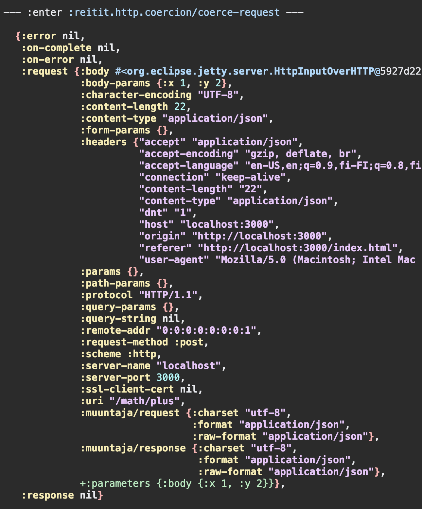

# Transforming the Interceptor Chain

There is an extra option in http-router (actually, in the underlying interceptor-router): `:reitit.interceptor/transform` to transform the interceptor chain per endpoint. Value should be a function or a vector of functions that get a vector of compiled interceptors and should return a new vector of interceptors.

**Note:** the last interceptor in the chain is usually the handler, compiled into an Interceptor. Applying a transformation `clojure.core/reverse` would put this interceptor into first in the chain, making the rest of the interceptors effectively unreachable. There is a helper `reitit.interceptor/transform-butlast` to transform all but the last interceptor.

## Example Application

```clj
(require '[reitit.http :as http])
(require '[reitit.interceptor.sieppari :as sieppari])

(defn interceptor [message]
  {:enter (fn [ctx] (update-in ctx [:request :message] (fnil conj []) message))})

(defn handler [req]
  {:status 200
   :body (select-keys req [:message])})

(def app
  (http/ring-handler
    (http/router
      ["/api" {:interceptors [(interceptor 1) (interceptor 2)]}
       ["/ping" {:get {:interceptors [(interceptor 3)]
                       :handler handler}}]])
    {:executor sieppari/executor}))

(app {:request-method :get, :uri "/api/ping"})
; {:status 200, :body {:message [1 2 3]}}

```

### Reversing the Interceptor Chain

```clj
(def app
  (http/ring-handler
    (http/router
      ["/api" {:interceptors [(interceptor 1) (interceptor 2)]}
       ["/ping" {:get {:interceptors [(interceptor 3)]
                       :handler handler}}]]
      {::interceptor/transform (interceptor/transform-butlast reverse)})
    {:executor sieppari/executor}))

(app {:request-method :get, :uri "/api/ping"})
; {:status 200, :body {:message [3 2 1]}}
```

### Interleaving Interceptors

```clj
(def app
  (http/ring-handler
    (http/router
      ["/api" {:interceptors [(interceptor 1) (interceptor 2)]}
       ["/ping" {:get {:interceptors [(interceptor 3)]
                       :handler handler}}]]
      {::interceptor/transform #(interleave % (repeat (interceptor :debug)))})
    {:executor sieppari/executor}))

(app {:request-method :get, :uri "/api/ping"})
; {:status 200, :body {:message [1 :debug 2 :debug 3 :debug]}}
```

### Printing Context Diffs

```clj
[metosin/reitit-interceptors "0.4.0-SNAPSHOT"]
```

Using `reitit.http.interceptors.dev/print-context-diffs` transformation, the context diffs between each interceptor are printed out to the console. To use it, add the following router option:

```clj
:reitit.interceptor/transform reitit.http.interceptor.dev/print-context-diffs
```

Sample output:



Sample applications (uncomment the option to see the diffs):

* Sieppari: https://github.com/metosin/reitit/blob/master/examples/http-swagger/src/example/server.clj
* Pedestal: https://github.com/metosin/reitit/blob/master/examples/pedestal-swagger/src/example/server.clj
